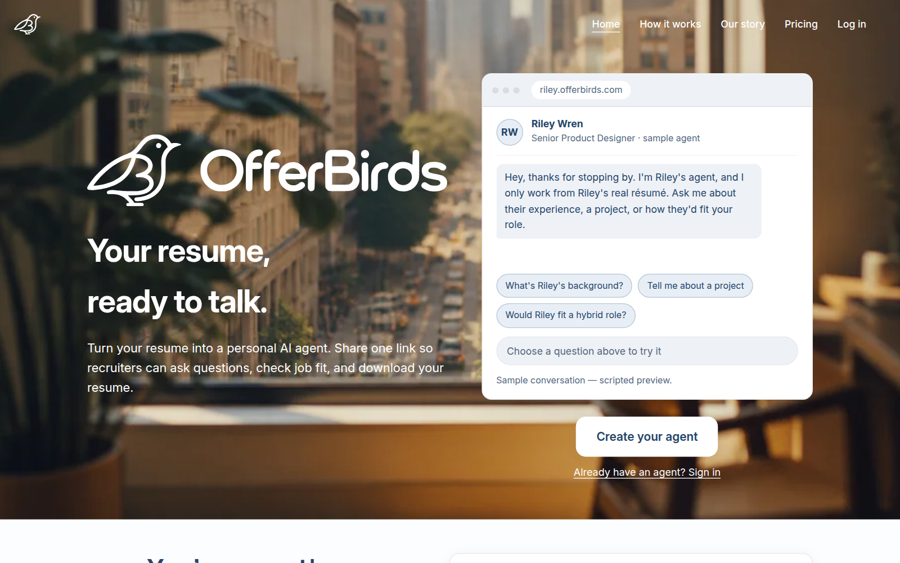
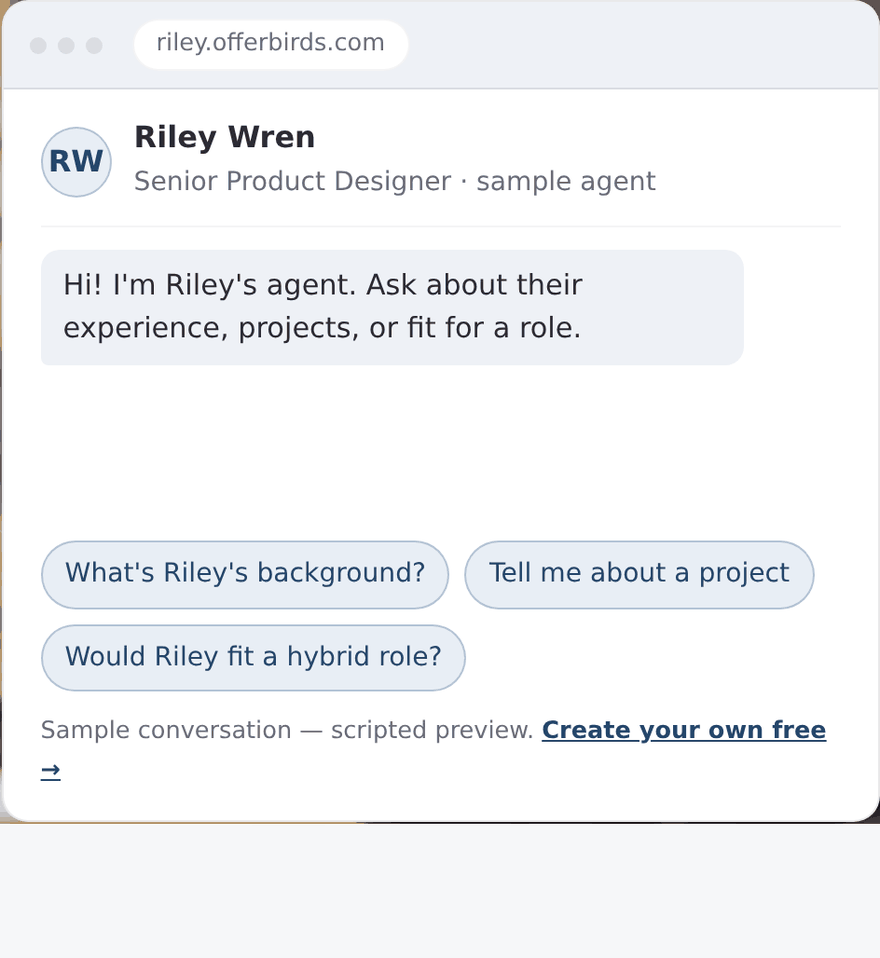
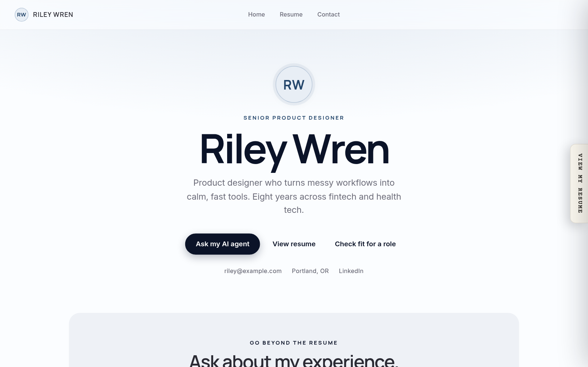
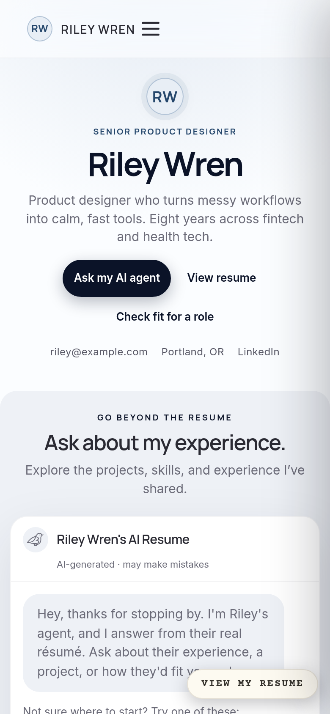
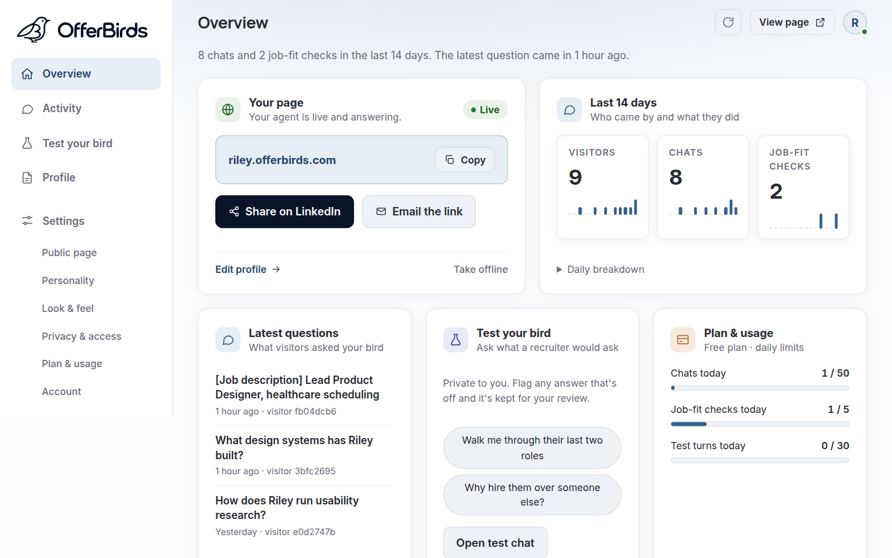
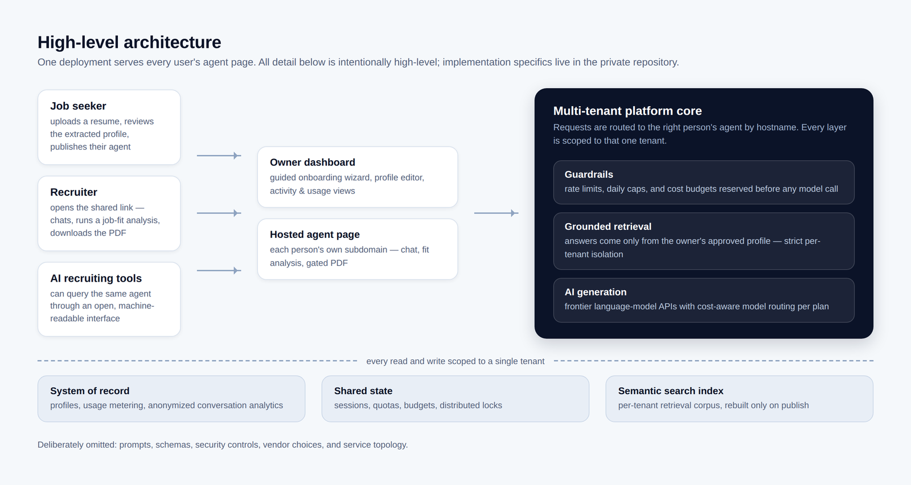

  <picture>
    <source media="(prefers-color-scheme: dark)" srcset="assets/offerbirds-logo-white.svg" />
    
  </picture>
  <h3>Your resume, ready to talk.</h3>
  
<em>Your career agent. Always on.</em>

---

> **This repository is a product showcase. The production source code is
> maintained in a private repository and is not included here.**

**OfferBirds** turns a resume into a personal AI agent with its own link.
Instead of sending a PDF into the void, you send
`yourname.offerbirds.com` — a page where recruiters chat with an agent that
knows your background, run instant job-fit analyses, and download your
resume, any hour of the day. Think of it as *Linktree for AI resume agents*:
other professions have representatives — why shouldn't you?

## The problem

A resume is a static document trying to do a conversational job. Recruiters
skim hundreds of PDFs, form questions nobody is there to answer, and move
on. Candidates compress a career into one page and hope the right details
survive the cut. Both sides lose information at exactly the moment it
matters most.

## Who it's for

- **Job seekers** who want their experience to be explorable, not skimmable
  — and want to learn what recruiters actually ask about them.
- **Recruiters and hiring managers** who want fast, grounded answers
  ("Would this person fit a hybrid role?", "Paste this JD — how close is
  the match?") without scheduling a call.
- **AI-powered recruiting tools**, which can query the same agent through
  an open, machine-readable interface instead of parsing a PDF.

## How it works

1. **Upload.** A resume as PDF, Word document, or pasted text. Extraction
   turns it into a structured profile you review and edit — nothing is ever
   invented on your behalf.
2. **Publish.** Pick a handle and go live at your own address. Every job,
   project, and section has a per-item visibility toggle, so anything you
   mark private stays out of the page, the chat, and the PDF.
3. **Share the link.** Recruiters ask questions in plain language, paste a
   job description for a structured fit analysis, and unlock your PDF with
   an access code you hand out.

From upload to a live, answering link takes about ten minutes.

## What's in the product

**For owners**

- Guided onboarding wizard: upload → review → claim your handle → live
- Per-item public/private visibility controls
- A private "test your bird" mode for rehearsing the agent against your
  draft profile before publishing
- Appearance presets — page themes and type styles to make it feel like you
- Activity view showing what visitors actually asked (anonymized — no
  visitor accounts, no tracking pixels)
- Usage dashboard, one-click unpublish, passwordless sign-in

**For visitors**

- Grounded chat that streams token by token: the agent answers only from
  the approved profile, and says "that's not on the resume" rather than
  guessing
- Long conversations stay coherent: older turns are compacted into a
  rolling memo of what the visitor has asked, so context never overflows
- Job-description fit analysis with structured output
- Access-code-gated PDF download
- An agent-interoperability endpoint (Model Context Protocol), so a
  recruiter's own AI tooling can interview the agent with the same limits
  as the web page

**Built-in cost and abuse protection** — every page has daily conversation
caps, per-visitor limits, and platform-wide budgets, so an owner never gets
a surprise bill.

## Screenshots

*All people, resumes, and conversations shown are fictional demo data.*

**Landing page**

**Product demo — a scripted sample conversation**

**A published agent page** (synthetic demo profile)

**Mobile view**

  

**Owner dashboard** — live status, share tools, the last 14 days of
activity, and what visitors actually asked

## Architecture at a glance

Any number of identical app instances serve every user's agent page; none
holds state the others need. A request to `yourname.offerbirds.com` is
resolved to that person's tenant by hostname, and everything downstream —
retrieval, generation, quotas, storage — is scoped to that single tenant:

- **Guardrails first.** Rate limits, daily caps, and cost budgets are
  reserved *before* any model call and refunded on failure.
- **Grounded retrieval.** Each agent answers from a per-tenant retrieval
  corpus built only from the owner's approved profile, with strict
  isolation between tenants enforced at the retrieval layer.
- **Cost-aware generation.** A lightweight router classifies each question
  and picks a model within the owner's plan.
- **Tenant-scoped storage.** A system of record, shared state for sessions
  and quotas, and a semantic search index — every read and write bound to
  one tenant.
- **Strong consistency across instances.** Caches are keyed by content
  version, so a republished profile is served correctly by every instance
  on the next request — no stale answers and no single-writer bottleneck.
  Background jobs elect one runner per interval through shared state.

This diagram is intentionally high-level. Prompts, schemas, security
controls, vendor choices, and service topology are deliberately omitted.

## Technology

- **Backend:** Python — one async web application, horizontally scalable,
  serving all tenants
- **AI:** frontier language-model APIs behind a provider seam (the base
  model is one config flip), with streamed responses, retrieval-grounded
  generation, and cost-aware model routing
- **Frontend:** server-rendered pages with a deliberately no-build vanilla
  JavaScript layer and a token-based design system
- **Data:** relational system of record, in-memory shared state, and a
  vector search index — all multi-tenant with per-tenant isolation
- **Quality:** CI-enforced test suite including tenant-isolation regression
  tests, cross-tenant leak tests, and browser-driven end-to-end runs

Implementation details are proprietary and live in the private repository.

## Status

🚧 **In active development.** The product works end-to-end as a prototype —
onboarding, publishing, agent chat, fit analysis, PDF, and the
interoperability endpoint — and is being hardened for public launch. Not
yet publicly available.

- **Live product:** _coming soon_ — `https://offerbirds.com` <!-- placeholder: swap in the live URL at launch -->
- **Waitlist / contact:** [dakotaradigan@gmail.com](mailto:dakotaradigan@gmail.com)

## My role

I'm [Dakota Radigan](https://github.com/dakotaradigan). I designed and
built OfferBirds end-to-end: product concept, brand and visual identity,
UX, the multi-tenant backend architecture, the retrieval and
model-routing systems, and the test and CI infrastructure.

## Rights

Copyright © 2026 Dakota Radigan. All rights reserved. The OfferBirds
product, name, bird mark, documentation, and media in this repository are
proprietary; no source-code license is granted. See
[NOTICE.md](NOTICE.md).

---

*This repository is a product showcase. The production source code is
maintained in a private repository and is not included here.*
