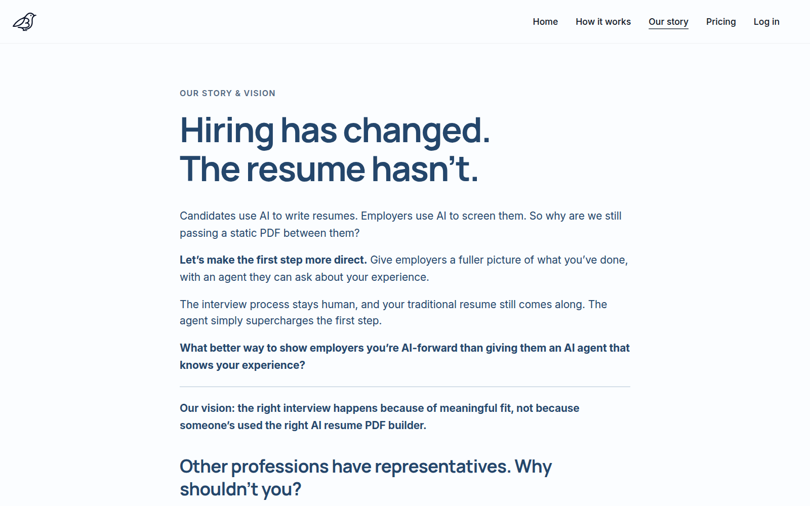
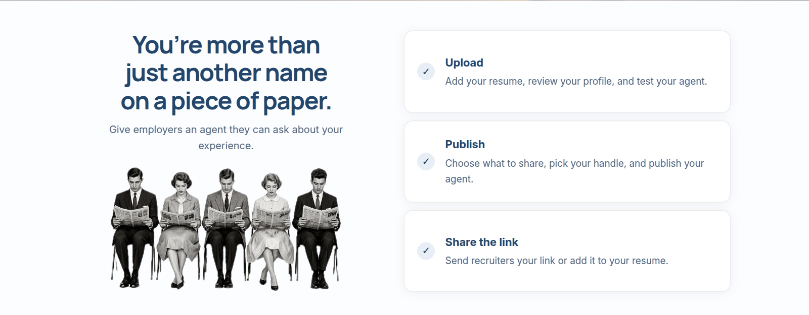
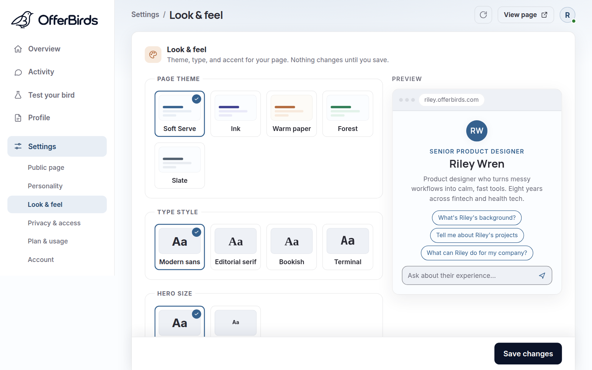

  <picture>
    <source media="(prefers-color-scheme: dark)" srcset="assets/offerbirds-logo-white.svg" />
    
  </picture>
  <h3>Your resume, ready to talk.</h3>
  
<em>Your career agent. Always on.</em>

---

> **This repository is a product showcase. The production source code is
> maintained in a private repository and is not included here.**

**OfferBirds** turns a resume into a personal AI agent with its own link.
Instead of sending a PDF into the void, you send
`yourname.offerbirds.com`: a page where recruiters chat with an agent that
knows your background, check how well you fit a role, and download your
resume, any hour of the day. Think of it as *Linktree for AI resume agents*.

## Why

**Hiring has changed. The resume hasn't.** Candidates use AI to write
resumes. Employers use AI to screen them. Yet the two sides still pass a
static PDF back and forth.

A resume is a document trying to do a conversational job. Recruiters skim
hundreds of PDFs, form questions nobody is there to answer, and move on.
Candidates squeeze a career onto one page and hope the right details
survive. OfferBirds makes the first step a conversation. The interview
stays human, and the traditional resume still comes along.

*Other professions have representatives. Why shouldn't you?*

## Who it's for

- **Job seekers** who want their experience to be explorable, not
  skimmable, and want to learn what recruiters actually ask about them.
- **Recruiters and hiring managers** who want fast, grounded answers
  ("Would this person fit a hybrid role?", "Here's the job description.
  How close is the match?") without scheduling a call.
- **AI recruiting tools**, which can query the same agent through an open,
  machine-readable interface instead of parsing a PDF.

## How it works

1. **Upload.** Add a resume as a PDF, Word document, or pasted text. It is
   turned into a structured profile you review and edit. Nothing is
   invented on your behalf. Then test your agent privately.
2. **Publish.** Choose what to share, down to each job, project, and
   section, pick your handle, and go live at your own address.
3. **Share the link.** Send recruiters your link or add it to your resume.
   They ask questions in plain language, paste a job description for a fit
   check, and unlock your PDF with an access code you hand out.

## See it in action

*All people, resumes, and conversations shown are fictional demo data.*

**A scripted sample conversation** (from the landing page)

  

**A published agent page**

**On a phone**

  

**Owner dashboard:** live status, share tools, the last 14 days of
activity, and what visitors actually asked

**Look & feel:** page themes, type styles, and a live preview

## What's in the product

**For owners**

- Guided onboarding: upload → review → claim your handle → live
- Per-item public/private controls. Private items stay out of the page,
  the chat, and the PDF.
- **Test your bird:** a private chat with your draft agent. Ask it what a
  skeptical recruiter would, and flag answers that miss.
- **Personality:** choose how your agent talks, and optionally add
  interview-style context (working style, how you handle pressure) it can
  draw on when asked
- **Look & feel:** five page themes, four type styles, and a custom
  accent color, with a live preview before you save
- Activity view of what visitors asked. Visitors are anonymous: no
  visitor accounts, no tracking pixels.
- Optional **LinkedIn identity badge** that states exactly what it proves:
  the owner controls a LinkedIn account with that name. It does not
  verify work history.
- Privacy switches that are off by default: search-engine indexing, and
  machine-readable access for AI tools
- Passwordless sign-in (email link or Google), one-click "take page
  offline", and full account deletion

**For visitors**

- Grounded chat that streams in as it's written. The agent answers only
  from the published profile and says so when something isn't there,
  rather than guessing.
- Long conversations stay coherent: older turns are condensed into a
  running summary, so the agent keeps the thread
- Job-description fit analysis with a structured result
- Access-code-gated PDF download
- An open interface for AI tools (Model Context Protocol, plus a
  plain-text profile digest) when the owner turns it on. A recruiter's
  own AI assistant can ask questions, run a fit check, or compare several
  candidates, with the same limits and visibility rules as the web page.

**Cost and abuse protection built in:** daily conversation caps,
per-visitor limits, and platform-wide budgets, so an owner never gets a
surprise bill and requests simply pause when a limit is reached.

## Planned pricing

These plans are shown on the site. They are not yet available and may
change before launch.

| Plan | Price | Highlights |
|---|---|---|
| **Free** | $0 | Your agent at your own link, recruiter chat and a daily fit check with daily limits |
| **Hosted** | $20 / month | Higher limits, see every question recruiters asked, PDF behind your access code, no badge |
| **Agent** *(in development)* | $39 / month | Your agent talks to recruiters' agents: agent-to-agent interviews, alerts when a company engages, your own domain |

## Architecture at a glance

Every user's agent page is served by the same stateless application, which
can run as many identical instances as traffic needs. A request to
`yourname.offerbirds.com` is matched to that person's account by its
address. Everything after that (retrieval, generation, quotas, storage) is
scoped to that one account:

- **Guardrails first.** Rate limits, daily caps, and cost budgets are
  reserved *before* any model call and refunded if the call fails.
- **Grounded retrieval.** Each agent answers from its own search index,
  built only from the owner's published profile. Isolation between
  accounts is enforced inside the retrieval layer itself.
- **Publish is a snapshot.** Publishing freezes an immutable version of
  the profile. The live page, the chat, and the PDF all read from that one
  snapshot, so editing a draft never leaks onto the public page.
- **Cost-aware generation.** A lightweight router sorts each question and
  picks a model within the owner's plan. Repeated context is cached so a
  typical turn costs far less.
- **Consistent across instances.** Caches are keyed by content version, so
  a republished profile is served correctly everywhere on the next request.

This is intentionally high-level. Prompts, schemas, security controls,
vendor choices, and service topology are deliberately left out.

## How it's built

- **Backend:** Python, one async web application serving every account
- **AI:** frontier language-model APIs behind a provider-neutral layer,
  with streamed responses, retrieval-grounded answers, and cost-aware
  model routing
- **Frontend:** server-rendered pages, a deliberately no-build vanilla
  JavaScript layer, and a token-based design system with a living style
  guide
- **Data:** a relational system of record, an in-memory store for
  sessions and quotas, and a vector search index. All three are
  multi-tenant, with per-account isolation.

**Engineering practices**

- A test suite of roughly 800 automated tests, run in CI on every change.
  It includes tenant-isolation and cross-account leak tests, a
  prompt-injection suite, and browser-driven end-to-end runs at desktop
  and phone sizes with automated accessibility checks.
- A golden-set evaluation harness: synthetic resumes, chat questions, and
  job descriptions with pass/fail thresholds, replayed in CI so answer
  quality can't silently regress
- Security scanning in CI: dependency audits, static analysis, secret
  scanning, and container image scanning
- Operational readiness work: failure-injection testing, runbooks,
  metrics and alert thresholds, load testing, and a data-retention
  program with automatic cleanup
- Privacy by design: anonymized visitor analytics, time-limited
  conversation retention, opt-in search indexing, and a
  "no real personal data in the repo" rule enforced in CI

Implementation details are proprietary and live in the private repository.

## Status

🚧 **Feature-complete prototype, preparing for launch.** Onboarding,
publishing, streamed agent chat, fit analysis, PDF, and the AI-tool
interface all work end to end. The current milestone is production
readiness: hosting, monitoring, and launch hardening. It is not yet
publicly available.

- **Live product:** _coming soon_ at `https://offerbirds.com`
- **Early access / contact:** [dakotaradigan@gmail.com](mailto:dakotaradigan@gmail.com)

## My role

I'm [Dakota Radigan](https://github.com/dakotaradigan). I designed and
built OfferBirds end to end: the product concept, brand and visual
identity, UX, the multi-tenant backend, the retrieval and model-routing
systems, and the test and CI infrastructure.

## Rights

Copyright © 2026 Dakota Radigan. All rights reserved. The OfferBirds
product, name, bird mark, documentation, and media in this repository are
proprietary. No source-code license is granted. See
[NOTICE.md](NOTICE.md).

---

*This repository is a product showcase. The production source code is
maintained in a private repository and is not included here.*
